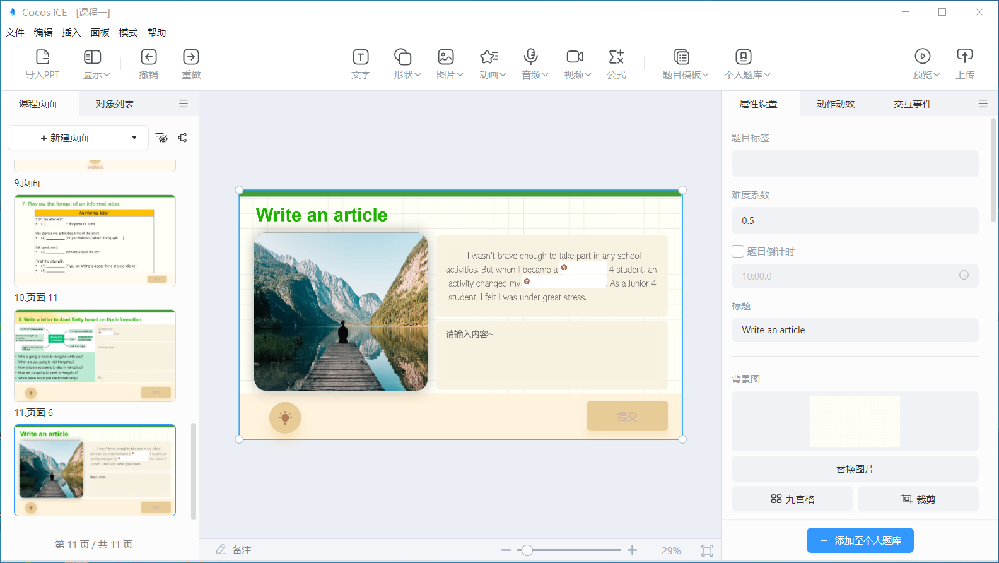
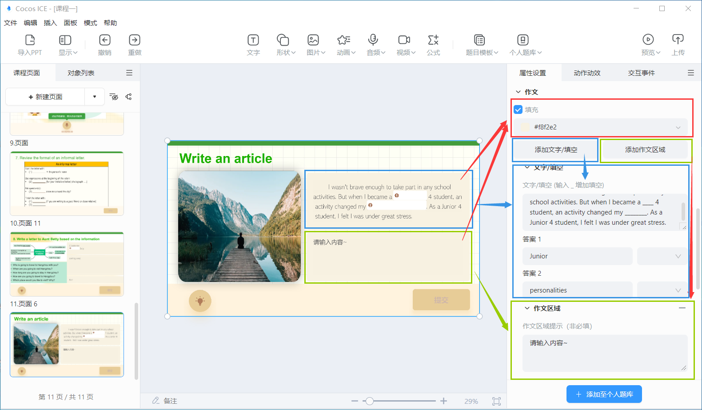
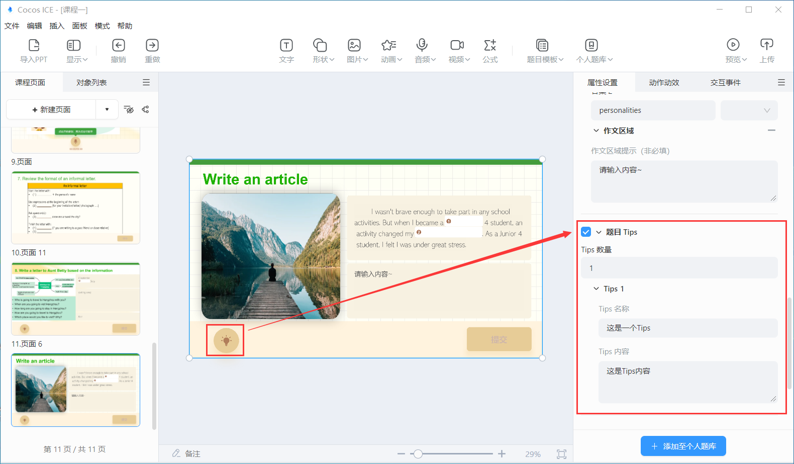
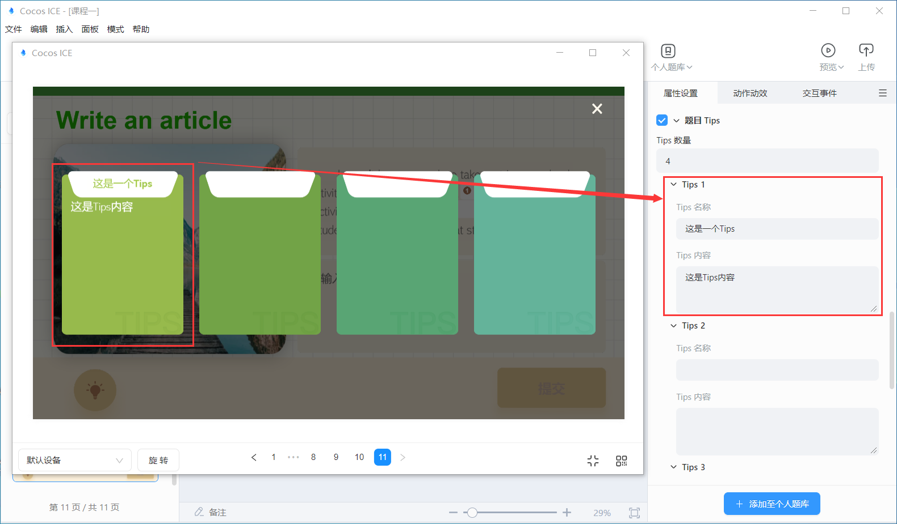
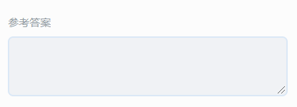
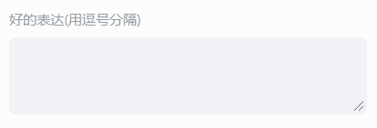

# 作文模板

工具栏点击 **题目模板**，下载完作文模板后，便可选择作文模板，将模板插入到编辑器内。

## 作文模板属性配置

选中作文模板，便可在编辑右侧的属性面板内，进行模板的属性配置。

属性侧显示的配置内容包括：

- 题目的标签：题目的知识点标签。
- 难度系数：题目的难易系数，老师可根据题目的难易程度自由设置，难易系数设置范围为 0-1。
- 题目倒计时：题目的答题倒计时，在设置的倒计时范围内，学生可以进行作文的答题，第一次作答时倒计时结束将自动提交学生答案，二次作答时倒计时结束将向学生确认是否提交答案。
- 标题：题目的标题。在场景中选中也可以编辑。
- 背景图片：题目的背景图片，建议尺寸 1920*1080（最佳）。
- 题目内容：可以根据需要自由添加素材库或本地的文字、图片、音频、视频或删除。在场景中选中也可以编辑。默认展示一张图片。

    

- 作文内容：该区域的所有文字将按照配置顺序，在学生填写后，作为一篇完整的作文发送给 AI 进行批改，支持配置纯文字、填空、作文区域，支持配置这些区域的底色。

    

    - 文字/填空：
        - 默认展示 1 个文字/填空区域，可以点击按钮增加，也可以通过属性或在场景中选中该区域删除。
        - 输入下划线 **_** 增加填空，连续的下划线不会成为多个填空区域，而是增加填空区域的长度。
        - 每个填空区域可以设置参考答案或答案所属于的词汇类型，如果与设置的答案不同，将在答题结果页提示学生。
    - 作文区域：
        - 默认展示 1 个作文区域，可以点击按钮增加，也可以通过属性或在场景中选中该区域删除。
        - 作文区域可以输入提示作答内容，该内容在学生输入答案后时将隐藏。

- 题目 Tips：配置 Tips 后将展示 Tips 按钮，学生答题时如点击按钮确认查看 Tips，学生的总分将扣除 **15%**。

    

    - Tips 数量：支持配置 1-4 个 Tips 区域，配置几个展示几个。
    - Tips 名称：配置每个 Tips 区域的标题。
    - Tips 内容：配置每个 Tips 区域的具体内容。

        

- 参考答案：用于配置展示在答题结果页面的范文，并作为 AI 评测学生作文的参考依据。

    

- 好的表达：用于配置 AI 评测学生作文的参考依据，如学生的作文里有使用到好的表达的内容，评分将更高。不同的词汇或词组使用英文逗号 **,** 分隔。

    