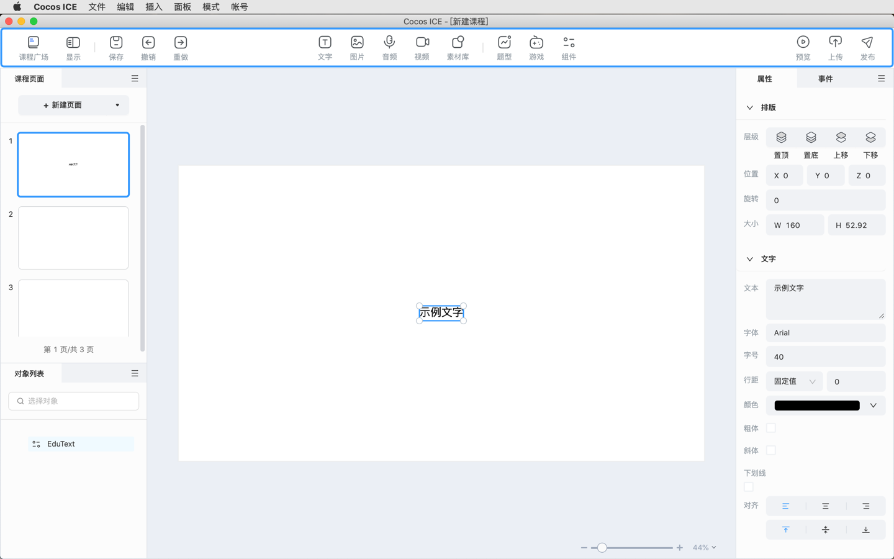
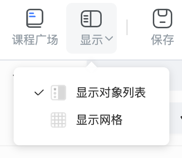
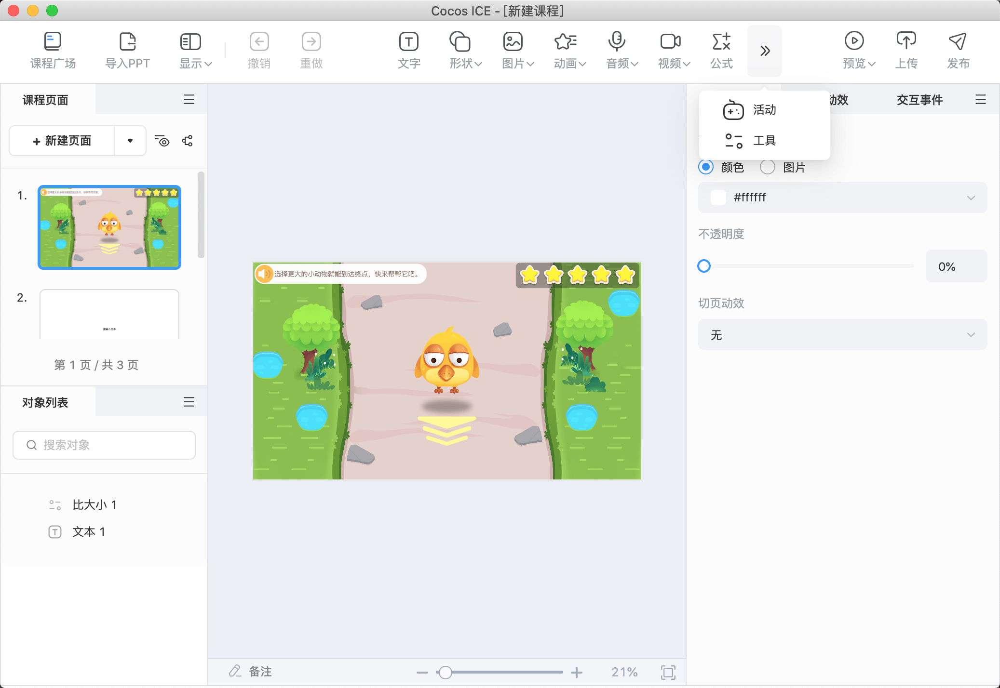

# 工具栏

工具栏展示一些 **常用功能入口**，便于用户使用编辑器，工具栏支持各公司自定义，便于灵活适用各公司的工作模式。（下图红框内为工具栏）

- 工具栏左侧依次为 **课程广场** 入口、**导入 PPT**、**显示**、**撤销** 和 **重做**。

    - **导入 PPT**：点击 **导入 PPT** 可以选择 `.pptx` 文件导入并自动新建一个课程，支持导入文字、图片、音视频等基础对象，也支持导入部分基础动效、直线路径动效和页面跳转超链接，还支持导入公式和表格，但导入公式和表格后不可编辑。
    - **显示**：点击 **显示对象列表** 将显示 **对象列表** 面板，点击 **显示网格** 将展示网格点，辅助用户进行对齐和内容的分布。

        

    - **撤销**：退回到编辑器中的上一步操作。
    - **重做**：还原已经撤销的操作。

- 工具栏中间的按钮可以快捷插入 [**基础对象**](object/index.md) 和 [**互动组件**](component/index.md)。

- 工具栏右侧为 **预览**、**上传**、**发布**。

- 工具栏自定义方法见 [**工具栏配置**](../developer/configure/toolbar/index.md) 文档。

- 编辑器窗口缩小或自定义按钮较多时，工具栏会自动折叠，点击  可以显示被折叠的按钮。

    
