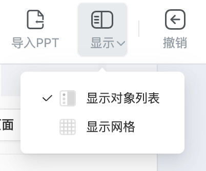

# 工具栏

工具栏展示一些 **常用功能入口**，便于用户使用编辑器。（下图红框内为工具栏）

- 工具栏左侧依次为 **导入PPT**、**显示**、**撤销**、**重做**

    - **显示**：点击 **显示对象列表** 将显示 **对象列表** 面板，点击 **显示网格** 将展示网格点，辅助用户进行对齐和内容的分布。

        

    - **撤销**：退回到编辑器中的上一步操作。

    - **重做**：还原已经撤销的操作。

- 工具栏中间的按钮可以快捷插入 [**基础对象**](object/index.md)、[**题目模板**](component/index.md) 和 [**个人题库**](personalcomponent/index.md)。

- 工具栏右侧为 **预览**、**上传**。

    - **预览**：可以点击 ，选择 **从头预览** 或者 **从当前预览**。**从头预览** 则会从第一页开始预览；**从当前预览** 则会用当前选中的页面进行预览。

        

    - **上传**：点击上传后，会出现提示弹窗，点击 **确认**，便可以把当前制作的课程上传到教学平台上。

        

- 工具栏自定义方法见 [**工具栏配置**](../developer/configure/toolbar/index.md) 文档。

- 编辑器窗口缩小或自定义按钮较多时，工具栏会自动折叠，点击  可以显示被折叠的按钮。

    
