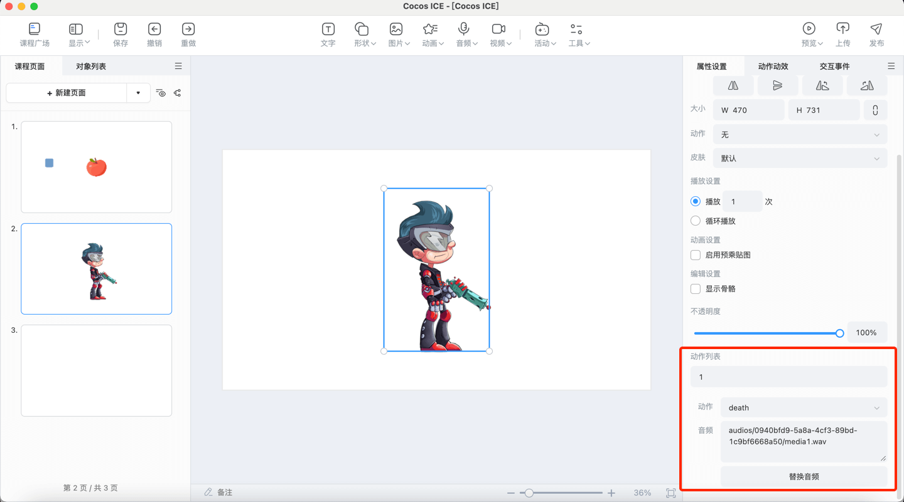

# 动画

## 插入动画

动画目前支持本地或素材库插入 Spine、DragonBones、GIF、粒子、序列帧动画。

> **注意**：为了粒子动画能在 ICE 中正常显示，推荐和美术或研发沟通将粒子动画的部分属性做如下设置后再导入：
> 1. SRC 设置为 GL_SRC_ALPHA；
> 2. DST 设置为 GL_ONE_MINUS_SRC_ALPHA。

## 编辑动画

选中动画对象，可以在场景中拖动、修改大小，在右侧属性面板编辑 **动画设置**、**播放设置** 等，Spine 和 DragonBones 可以设置 **动作**、**皮肤**。

支持企业开启 Spine 的切换动作配置，开启方法见 [**动画配置**](../../../developer/configure/animation_configuration/index.md)。开启配置后，支持点击 Spine 进行各个动作的切换，并支持对各个动作配置音频。如下图所示。

