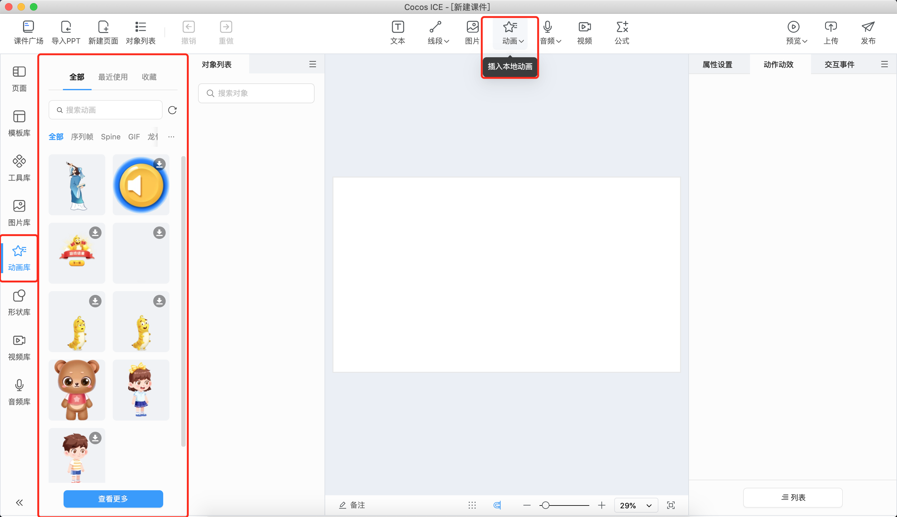
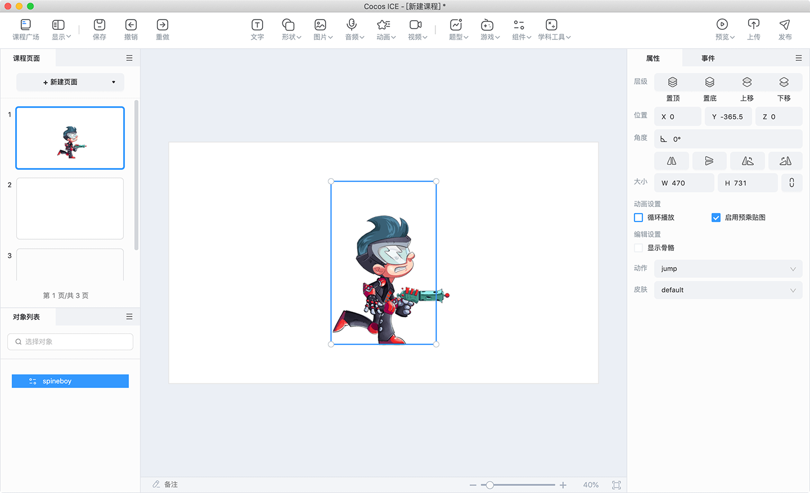
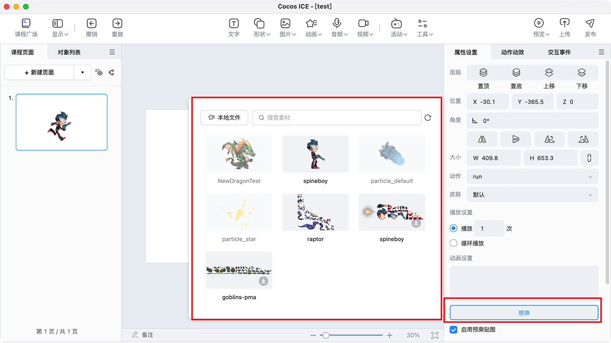

# 动画

## 插入动画

动画目前支持本地或素材库插入 Spine、DragonBones、粒子、GIF 和序列帧动画。

> **注意**：为了粒子动画能在 ICE 中正常显示，推荐和美术或研发沟通将粒子动画的部分属性做如下设置后再导入：
> 1. SRC 设置为 GL_SRC_ALPHA；
> 2. DST 设置为 GL_ONE_MINUS_SRC_ALPHA。

## 编辑动画

选中动画对象，可以在场景中拖动、修改大小，在右侧属性面板编辑 **播放设置**、**动画设置** 等，Spine 和 DragonBones 可以设置 **动作**、**皮肤**。

Spine 和 GIF 动画还支持选择素材库和本地的动画文件进行动画文件的替换，下图以替换 Spine 动画为例。

