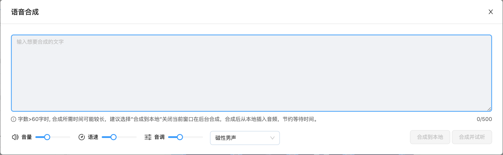
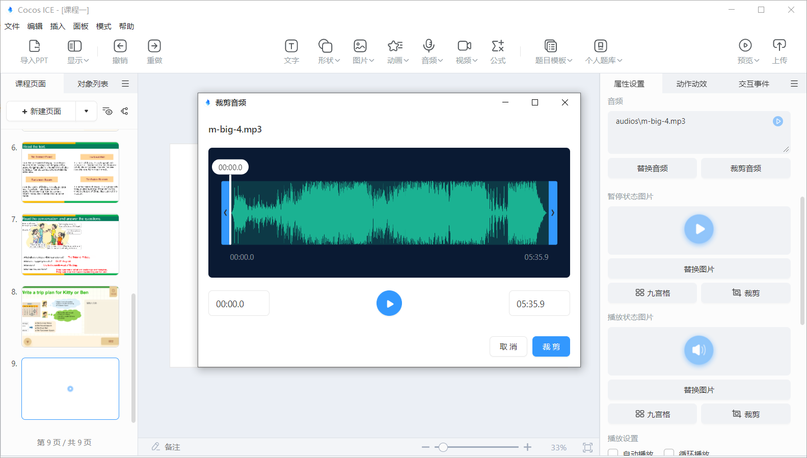
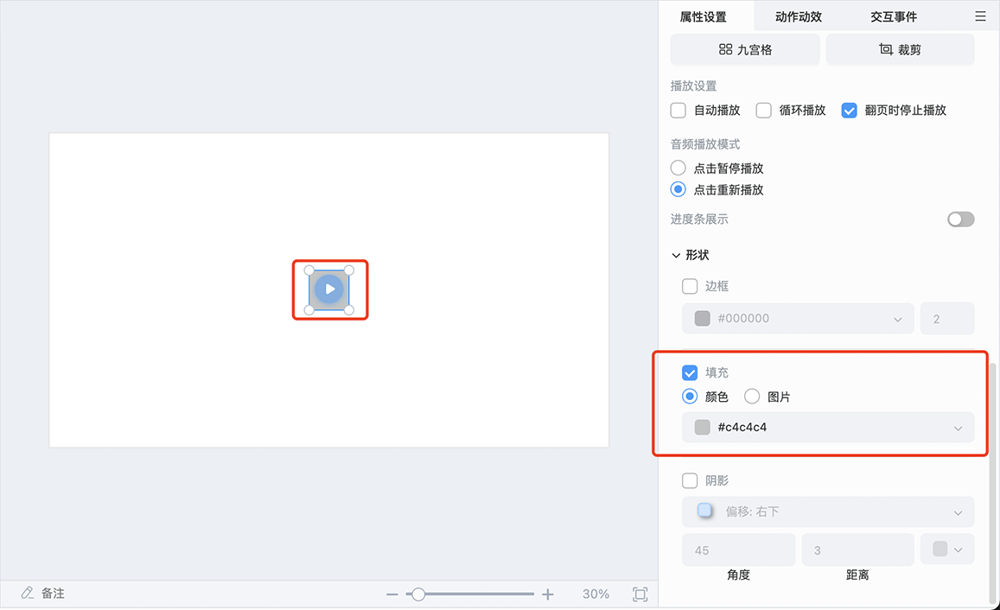
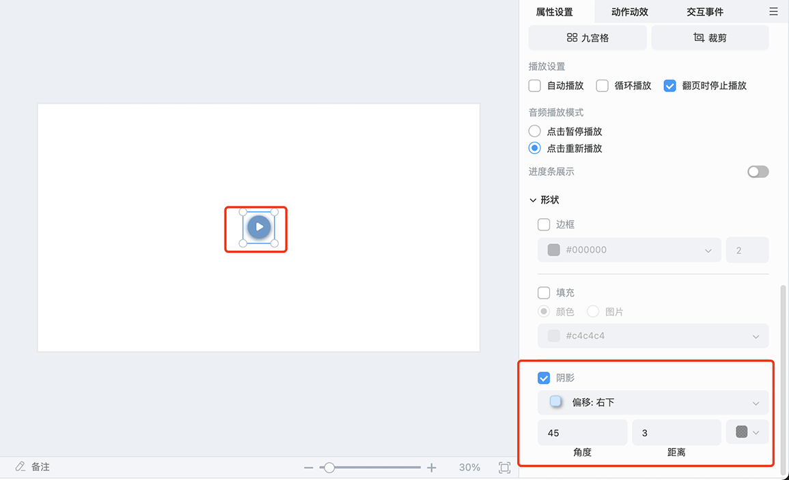

# 音频

## 插入音频

目前支持插入 Web 原生支持的格式的音频，包括 **mp3**、**wav**、**mp4**、**m4a**。

- 插入音频库音频：支持从素材库内选择音频文件，插入到 ICE 里。

    

- 插入本地音频：支持从本地文件里选择音频文件，插入到 ICE 里。

- 插入录音音频：支持插入录音音频，提供录制音频的功能，可以将录制完成的音频文件插入到 ICE 里。

    

- 插入语音合成音频：支持插入语音合成的音频，提供语音合成的功能，可以将文字内容转化为语音文件，并插入到 ICE 里。

    

## 编辑音频

选中音频对象，可以在右侧属性面板进行音频对象的编辑操作，包括 **替换音频**、**音频倍速设置**、**裁剪音频**、**音频默认图片**、**播放状态图片**、**音频播放设置**、**音频播放模式**、**音频进度条展示** 以及 **音频形状属性设置**。

- **替换音频**：可以选择音频库和本地的音频文件，也可以使用语音合成或录音，对当前音频进行替换。

- **音频倍速设置**：可以设置音频的默认播放倍速。

    

- **裁剪音频**：可以通过拖动首尾滑动条以及输入需要裁剪的时间，对当前音频的长度进行裁剪操作。

    

- **音频默认图片**、**音频播放图片**：可以选择素材库和本地的图片文件，对音频默认状态和音频播放状态的图片进行替换。

    

- **音频播放设置**：可以选择音频的自动播放和音频的循环播放，还可以设置是否翻页时停止音频的播放。

    

- **音频播放模式**：可以选择设置为点击暂停播放模式或者点击重新播放模式。

    

- **进度条展示**：开启后，会出现音频的进度条，此时可以设置仅在鼠标移入音频对象时，才会显示该进度条。

    

- **音频形状属性设置**：可以对音频的边框、填充以及阴影进行设置。

    1. **音频边框**：可以对音频的边框属性进行相应设置。支持设置边框颜色以及边框粗细。

        

    2. **音频填充**：可以对音频的填充属性进行相应设置。支持设置填充颜色或者图片。

        

    3. **音频阴影**：可以对音频的阴影属性进行相应设置。支持设置阴影方向、角度、距离以及颜色。

        

## 音频预览

若音频开启进度条，则音频也支持在预览时更改音频倍速以及音量的大小。

