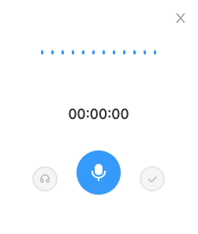
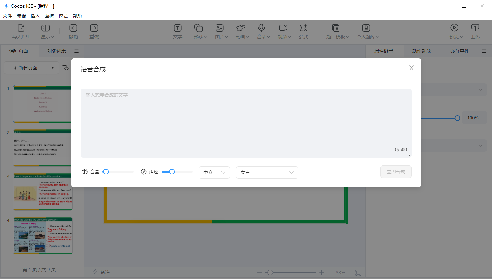
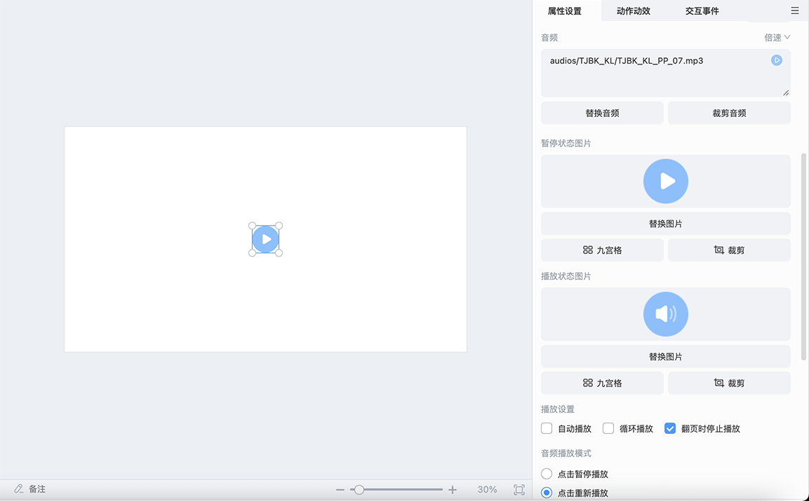
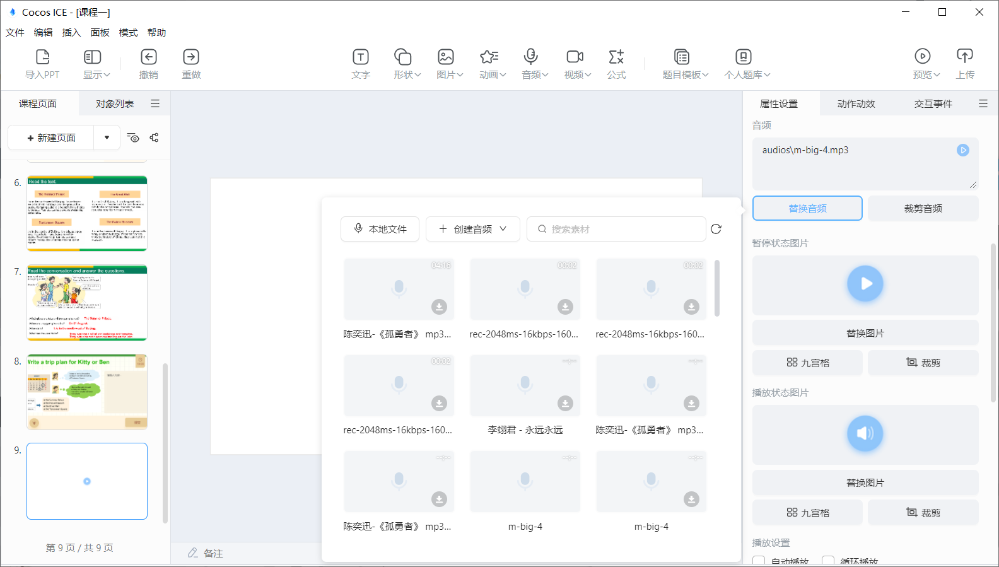
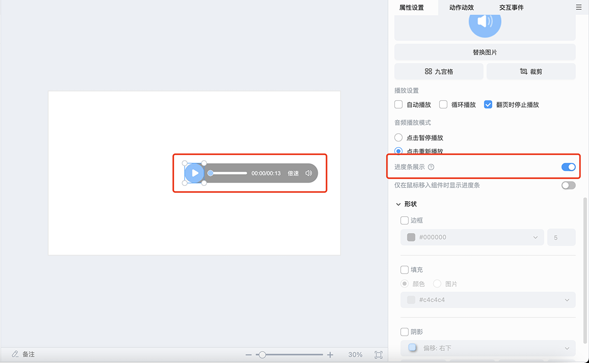

# 音频

## 插入音频

音频目前支持 Web 原生支持的格式，包括 **ogg**、**mp3**、**wav**、**mp4**、**m4a**，支持以下几种插入方法：

- **插入本地音频**：在工具栏点击音频按钮，点击弹窗左上角的 **本地文件**，选择本地音频后即可插入。

- **插入素材库内音频**：在工具栏点击音频按钮，会显示云端素材库的音频，先点击下载，再次点击后即可插入到场景中。

    

- **插入录音**：在工具栏点击音频按钮，点击 **创建音频** 按钮，选择 **录音**，即可录制音频并插入。

    

- **插入合成的语音**：在工具栏点击音频按钮，点击 **创建音频** 按钮，选择 **语音合成**，可以输入 500 字以内的文字，然后选择音量、语速、语种、声音类型，合成语音并插入。

    

## 编辑音频

选中音频对象，可以在右侧属性面板进行音频对象的编辑操作，包括 **替换音频**、**录制音频**、**裁剪音频**、**音频默认图片**、**播放状态图片**、**音频播放设置**、**音频播放模式**、**音频进度条展示** 以及 **音频形状属性设置**。

- **替换音频**：可以选择素材库和本地的音频文件、录音、语音合成，对当前音频进行替换。

    

- **裁剪音频**：可以通过拖动首尾滑动条以及输入需要裁剪的时间，对当前音频的长度进行裁剪操作。

    

- **音频默认图片**、**音频播放图片**：可以选择素材库和本地的图片文件，对音频默认状态和音频播放状态的图片进行替换。

    

- **音频播放设置**：可以选择音频的自动播放和音频的循环播放，还可以设置是否翻页时停止音频的播放。

    

- **音频播放模式**：可以选择设置为点击暂停播放模式或者点击重新播放模式。

    

- **进度条展示**：开启后，会出现音频的进度条，此时可以设置仅在鼠标移入音频对象时，才会显示该进度条。

    

- **音频形状属性设置**：可以对音频的边框、填充以及阴影进行设置。

    1. **音频边框**：可以对音频的边框属性进行相应设置。支持设置边框颜色以及边框粗细。

    2. **音频填充**：可以对音频的填充属性进行相应设置。支持设置填充颜色或者图片。

    3. **音频阴影**：可以对音频的阴影属性进行相应设置。支持设置阴影方向、角度、距离以及颜色。

        
