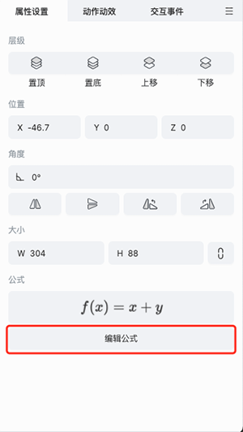
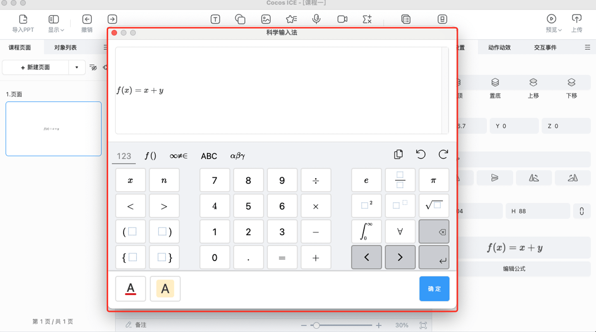
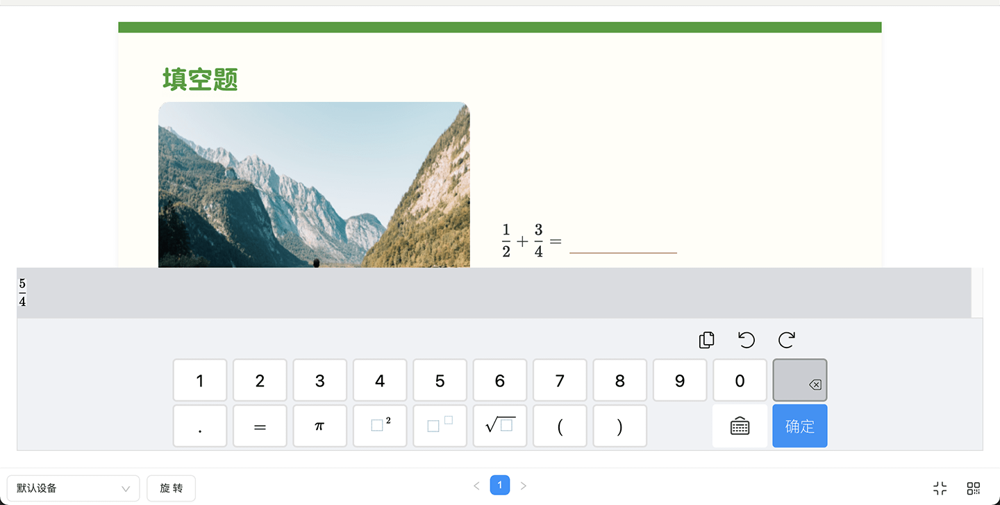

# 公式

选中公式对象，可以在右侧的属性面板查看该公式的缩略图，也可以点击属性面板的 **修改公式** 按钮，进行对公式对象的再次编辑。

## 修改公式

点击属性面板的 **修改公式** 按钮，会打开公式编辑面板，进行对公式的编辑。

在公式编辑面板内，可以进行对选中公式的再次编辑和保存。

## 答题时输入公式

学生在进行填空题模板的答题时，会出现调用公式进行填空的情况。点击公式键盘上的按键，便可以进行相应公式字符输入。

