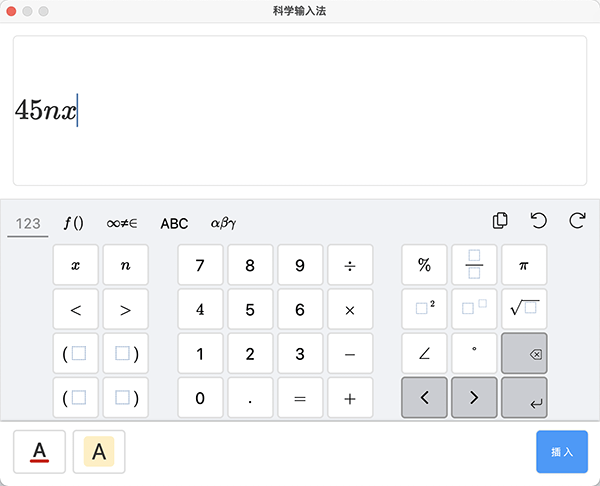
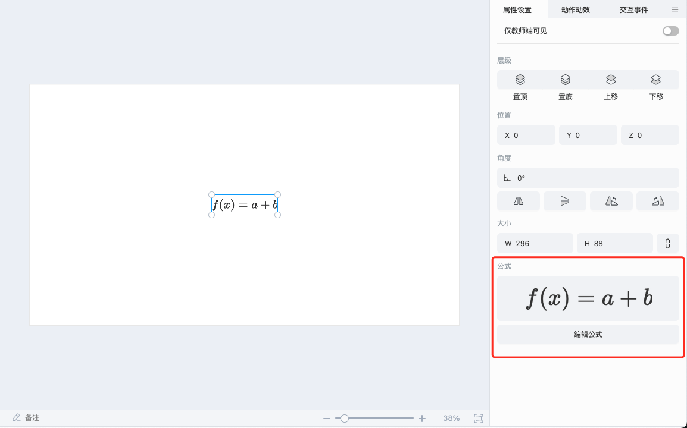
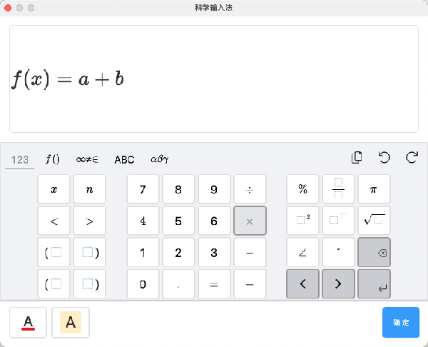

# 公式

选中公式对象，可以在右侧的属性面板查看该公式的缩略图，也可以点击属性面板的 **编辑公式** 按钮，进行对公式对象的再次编辑。

## 插入公式

点击工具栏的按钮，便会开启公式面板，输入需要的公式后，点击 **插入**，便可将输入的公式插入到 ICE 里。

## 编辑公式

点击属性面板的 **编辑公式** 按钮，会打开公式编辑面板，进行对公式内容的再次编辑。

输入要修改的公式内容，点击 **确定**，便完成对公式的再次编辑。

