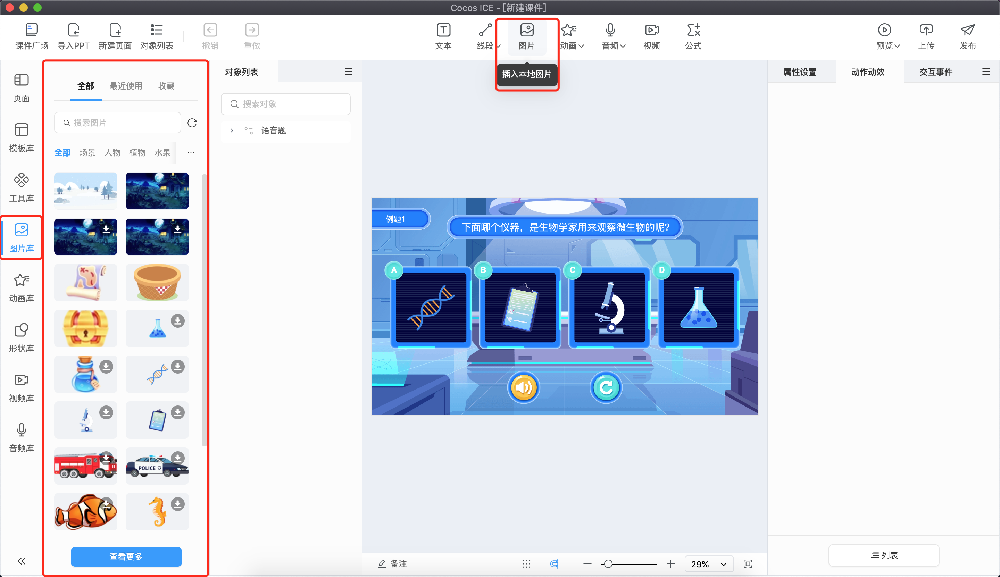
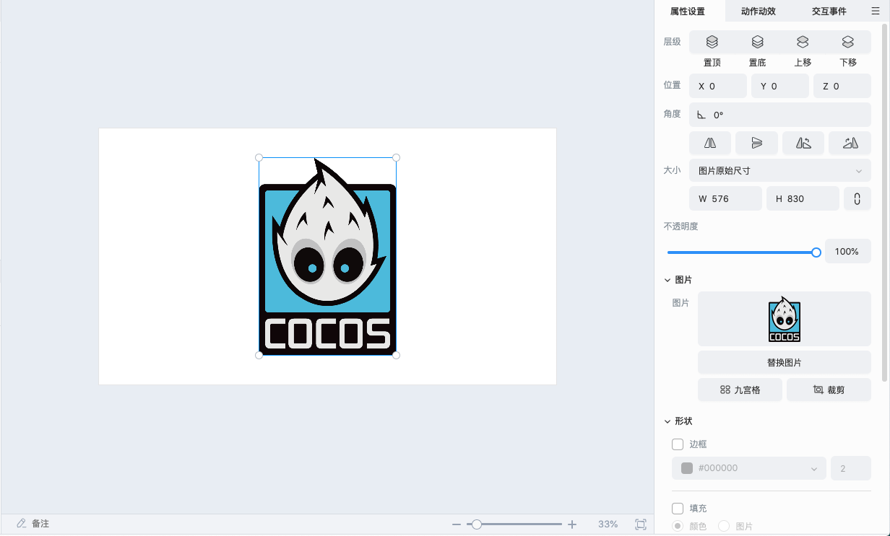
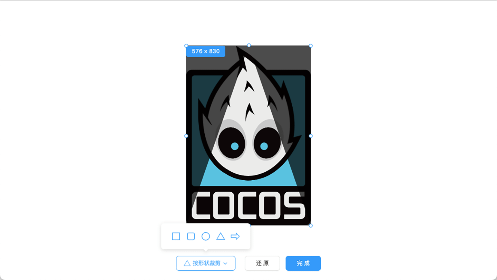
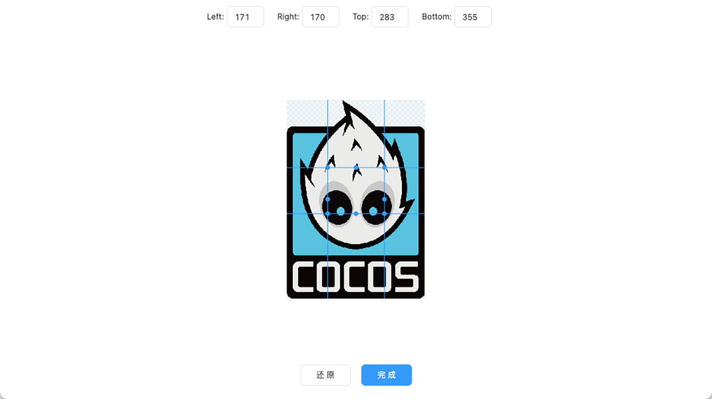
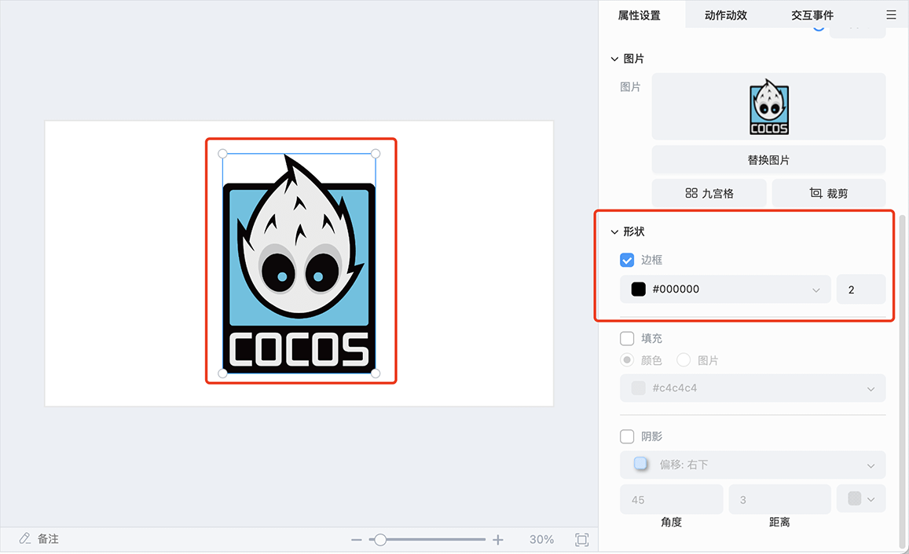
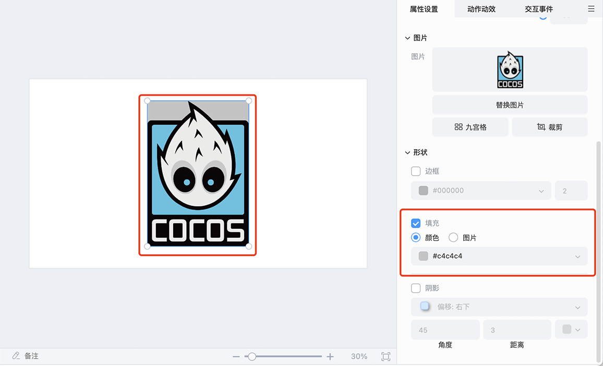
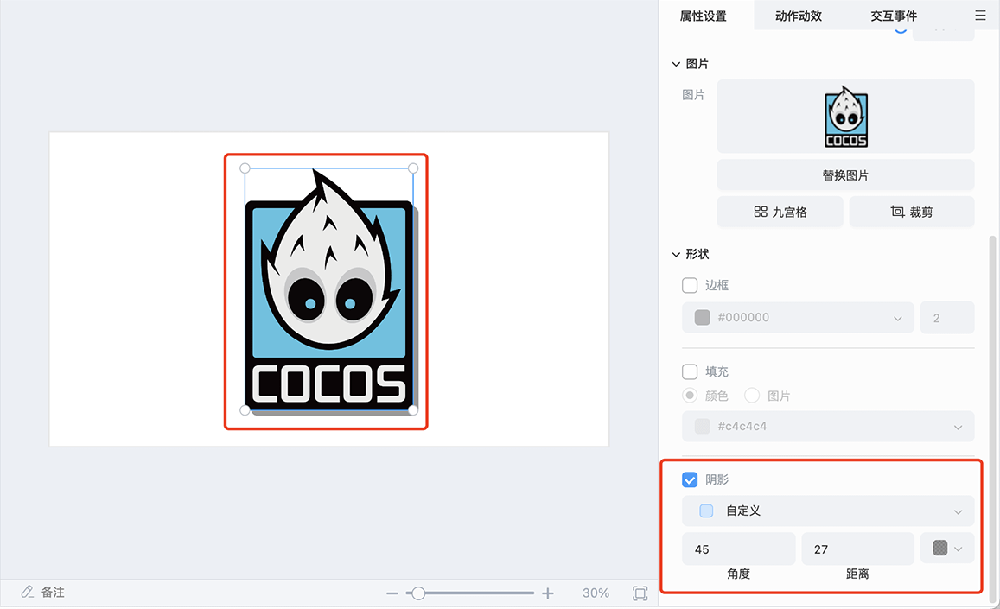
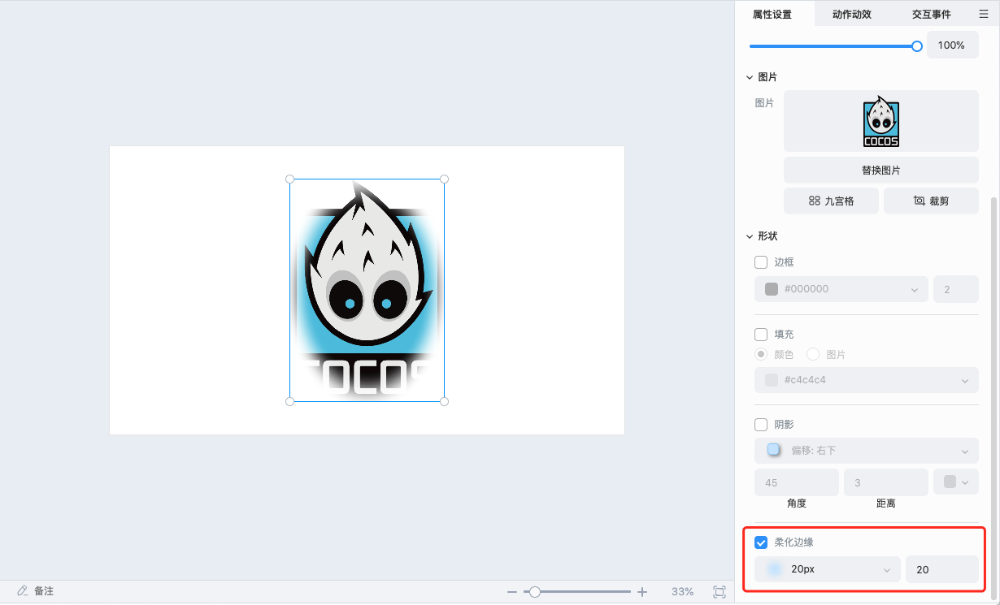

# 图片

## 插入图片

图片目前支持本地或素材库插入 **JPG**、**PNG** 格式，云端素材库的图片需要先点击下载，再次点击后才能插入到场景中。

## 编辑图片

选中图片对象，可以在右侧属性面板 **替换图片**、**裁剪图片**、**配置图片九宫格**、**设置图片透明度**、**设置图片边框**、**设置图片填充**、**设置图片阴影**、**设置柔化边缘**。

- **替换图片**：可以选择素材库或者本地的图片文件进行替换。

- **裁剪图片**：支持对图片进行按形状裁剪的操作。目前支持的形状有矩形、圆角矩形、原型、三角形以及箭头。

    

- **配置图片九宫格**：可以对图片进行配置九宫格的操作。

    

- **设置图片透明度**：可以调节图片的透明度。

- **图片边框**：可以对图片的边框属性进行相应设置。支持设置边框颜色以及边框粗细。

    

- **图片填充**：可以对图片的填充属性进行相应设置。支持设置填充颜色或者图片。

    

- **图片阴影**：可以对图片的阴影属性进行相应设置。支持设置阴影方向、角度、距离以及颜色。

    

- **柔化边缘**：可以对图片的柔化边缘属性进行相应设置。支持设置边缘柔化的距离。
    