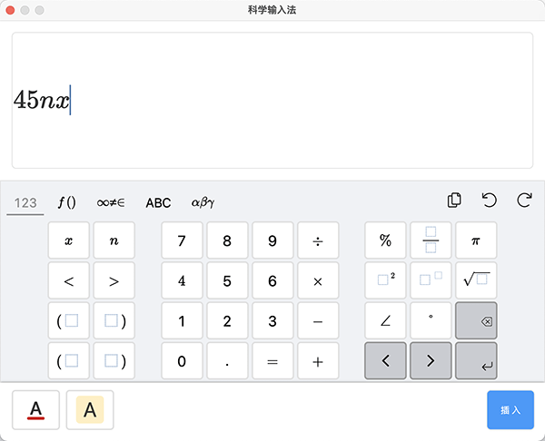

# 基础对象

基础对象包括 **文字**、**线段**、**图片**、**动画**、**音频**、**视频** 和 **公式**。而场景左侧的 [资源库](../../resource/index.md) 则用于存放 ICE 内置的部分基础对象素材，以及各公司接入的 **模板库**、**工具库**、**图片库**、**动画库**、**形状库**、**视频库** 和 **音频库** 素材。

## 插入对象

点击 **工具栏** 相应按钮即可插入对象到场景中。

- 文本：点击即可在场景中插入一个默认文本。

- 线段：点击后，可选择插入 **直线**、**单箭头**、**肘形箭头** 或者 **自由曲线**。

    

- 图片：点击后，可选择本地图片文件，插入到场景内。

- 动画：点击后，可选择本地动画文件，文件类型包括 Spine、DragonBones、GIF、序列帧和粒子动画，插入到场景内。

    

- 音频：点击后，可选择本地的音频文件、进行语音合成或者进行录制音频，插入到场景内。

    

- 视频：点击后，可选择本地的视频文件，插入到场景内。

- 公式：点击后，会开启公式面板，编辑完需要的公式后，便可以插入到场景内。

    

## 选取对象

选中对象有以下两种方式：

- 在场景中单击对象来选中。

- 点击工具栏中的 **对象列表**，打开 **对象列表** 来选中。

    

在场景和对象列表中按住 <kbd>Ctrl</kbd> 或 <kbd>Shift</kbd> 都支持多选对象。

## 移动对象

选取对象后，按住即可拖拽移动对象。

## 编辑对象

选取对象后，拖动约束框可以对对象进行缩放，还可通过 **属性**、**事件** 面板设置对象样式和动作条件。不同类型的对象可编辑的 **属性** 不同，可以点击以下链接查看。

- [文字](word/index.md)
- [形状](shape/index.md)
- [图片](image/index.md)
- [音频](audio/index.md)
- [视频](video/index.md)
- [动画](animation/index.md)
- [公式](formula/index.md)

## 组合对象

- **新建组合**：Windows 系统按住 Ctrl 键，MacOS 系统按住 Command 键，可以在对象列表内，进行多选对象的操作。对象多选完成后，右击鼠标，会打开操作面板，点击 **新建组合**，可以对多选的对象进行组合。

    

- **编辑组合**：生成一个新的组合对象后，可以在对象列表内，对组合对象进行编辑操作。编辑操作包括重命名、移动、删除、锁定和隐藏等。

    

- **取消组合**：鼠标右击选中的组合对象，也可以对已经组合的对象进行取消组合的操作。

    
