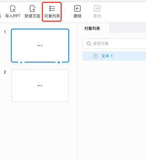

# 基础对象

基础对象包括 **文字**、**形状**、**图片**、**音频**、**视频** 和 **动画**。而 [素材库](../../resource/index.md) 则用于存放 ICE 内置的部分基础对象素材，以及各公司接入的 **图片**、**音频** 和 **视频** 素材。

## 插入对象

点击 **工具栏** 相应按钮即可插入对象到场景中

## 选取对象

选中对象有以下两种方式：

- 在场景中单击对象来选中。
- 点击工具栏中的 **显示 -> 显示对象列表**，打开 **对象列表** 来选中。

    

在场景和对象列表中按住 <kbd>Ctrl</kbd> 或 <kbd>Shift</kbd> 都支持多选对象。

## 移动对象

选取对象后，按住即可拖拽移动对象。

## 编辑对象

选取对象后，拖动约束框可以对对象进行缩放，还可通过 **属性**、**事件** 面板设置对象样式和动作条件。不同类型的对象可编辑的 **属性** 不同，可以点击以下链接查看。

- [文字](word/index.md)
- [形状](shape/index.md)
- [图片](image/index.md)
- [音频](audio/index.md)
- [视频](video/index.md)
- [动画](animation/index.md)

## 组合对象

Windows 系统按住 Ctrl 键，MacOS 系统按住 Command 键，可以在对象列表内，进行多选对象的操作。对象多选完成后，右击鼠标，会打开操作面板，点击 **新建组合**，可以对多选的对象进行组合。

生成一个新的组合对象后，对组合对象进行移动、删除、锁定、隐藏等操作时，组合内的对象也会进行相应的操作。

鼠标右击选中的组合对象，也可以对已经组合的对象进行取消组合的操作。

