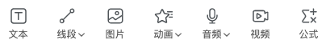

# 基础对象

基础对象包括 **文字**、**图片**、**音频**、**动画** 和 **视频**。

## 选取对象

将鼠标移动到对象上方并单击，或通过 **对象列表** 选中对象，选中对象后可通过 **属性** 面板进行修改。

## 移动对象

选中对象后长按即可拖拽移动对象，支持拖动约束框对对象进行缩放。

## 编辑对象

除了直接对对象进行拖拽移动和大小缩放外，还可通过 **属性**、**事件** 面板设置对象样式和动作条件。
