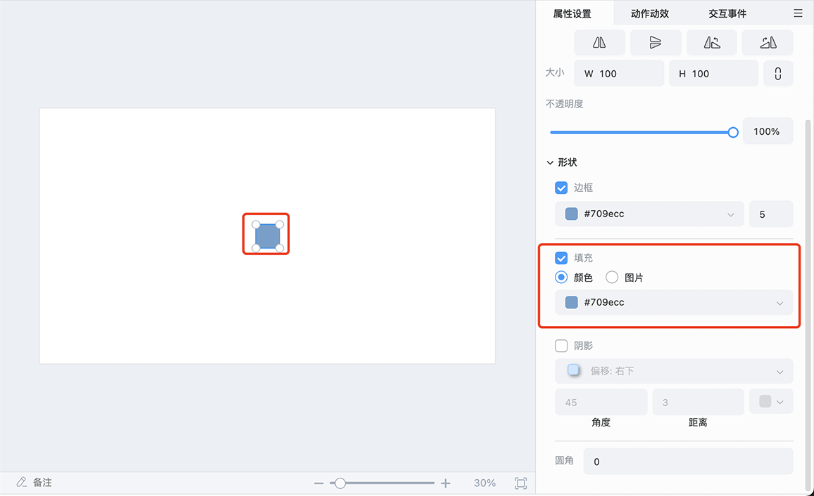
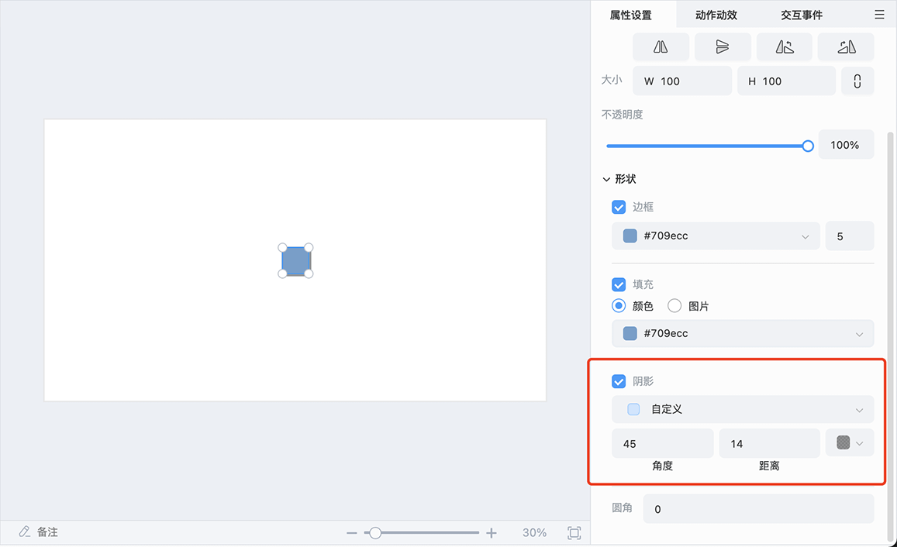
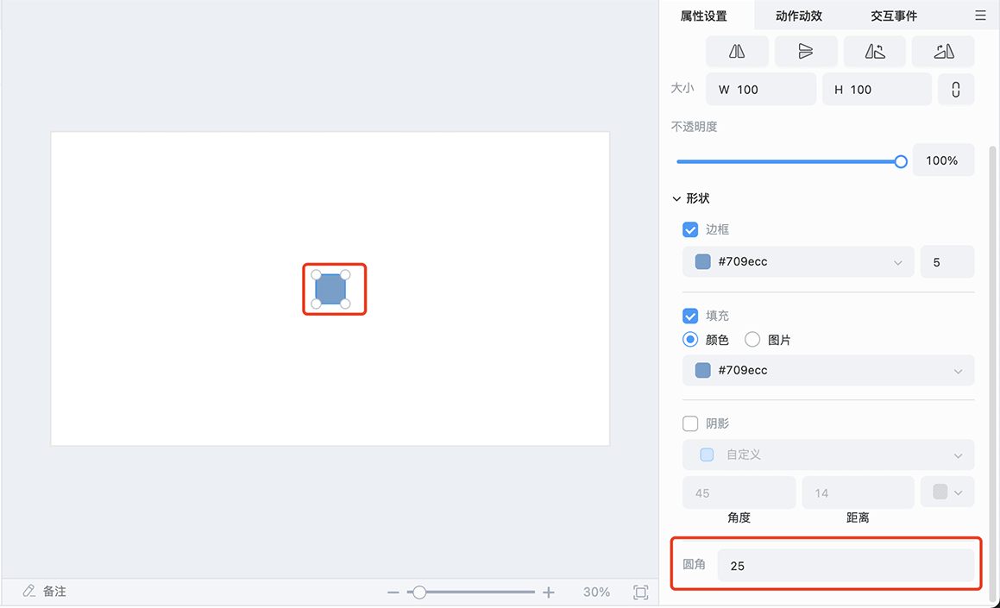

# 形状

点击 **菜单栏 -> 形状** 可选择以下线条或图形插入。

选中形状对象，可以在右侧属性面板编辑，不同形状的可编辑属性也不同，例如下图中的矩形，可编辑 **形状边框**、**形状填充**、**形状阴影** 和 **形状圆角**。

- **形状边框**：可以对形状的边框属性进行相应设置。支持设置边框的颜色以及边框的粗细。

    

- **形状填充**：可以对形状的填充进行相应设置。支持设置颜色或者图片填充。

    

- **形状阴影**：可以对形状的阴影进行相应设置。支持设置阴影方向、角度、距离以及颜色。

    

- **形状圆角**：部分形状可以配置形状的圆角角度，例如矩形以及圆角矩形。

    

双击形状对象，还可以在形状里编辑文字，此时形状的属性面板会新增关于文本的属性。

> **注意**：线条类型的形状不支持插入文字。
