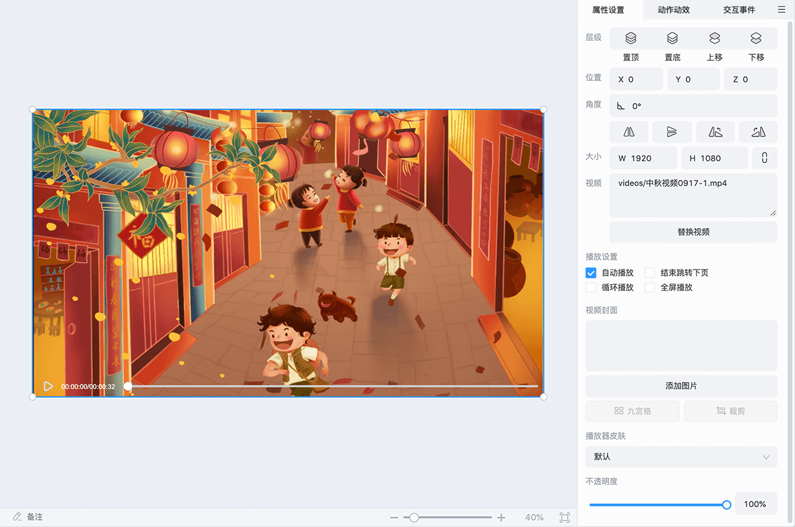
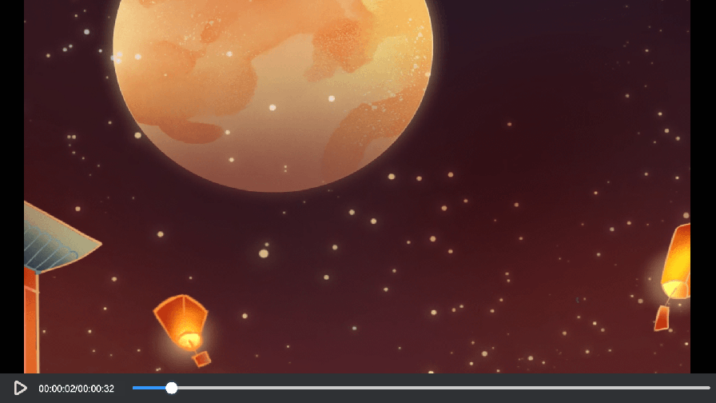

# 视频

选中视频对象，可以在右侧属性面板编辑 **视频文件**、**视频播放设置**、**视频封面**、**视频播放器皮肤**、**视频不透明度**。

- **视频文件** 目前 ICE 支持的视频格式为 **mp4**。

- **视频播放设置** 支持设置自动播放、视频播放结束自动跳转下页、循环播放、全屏播放。

    >**注意**：一些移动端的浏览器或 WebView 不允许自动播放视频，即使设置了自动播放，也需要用户手动播放视频。

- **视频封面** 开启视频封面并设置图片会在视频开头未播放时显示封面，开始播放后消失。

- **视频播放器皮肤** 有 3 种可以选择，后续版本将支持公司自定义。

    - **默认**：效果如下图。

        

    - **默认-不遮挡视频**：效果如下图。

        

    - **默认-仅老师可见**：适用于 1 V 1、小班课、大班课等多端教学场景，老师端效果同 **默认** 皮肤，学生端效果如下图。

        
