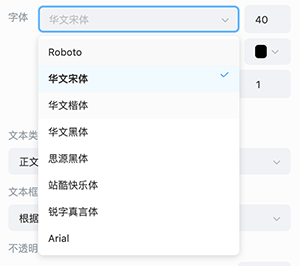
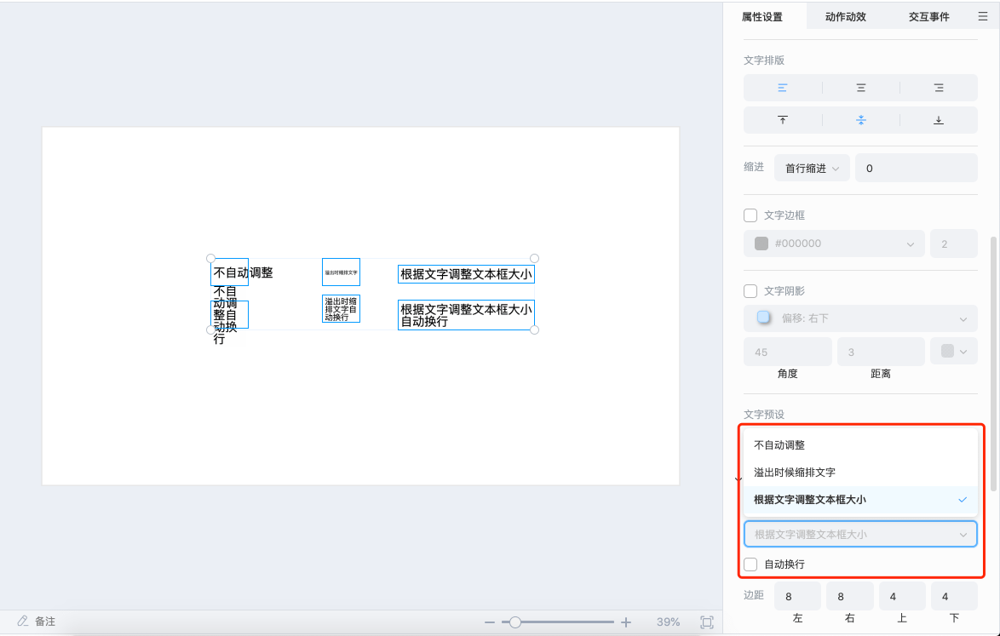

# 文字

选中文字对象，可以在右侧属性面板编辑 **文本内容**、**字体**、**字号**、**行距**、**颜色**、**特殊样式**、**对齐方式**、**文字预设**、**文本框类型**、**形状** 等。

## 编辑文本

ICE 支持编辑文本内容、字体、字号、加粗、斜体、下划线、字体颜色、行距、文字排版（对齐方式）、首行缩进、文字边框、文字阴影、文字预设，整体操作与常用的文本编辑相似。

### 编辑字体

ICE 支持研发配置好自定义字体再把编辑器分发给老师，也支持老师直接选择电脑自带的系统字体，但字体版权需要企业内部注意管控，老师通过下拉框就可以选择使用，自定义字体的配置方法具体可查看研发手册的 [文字配置文档](../../../developer/configure/object/word/index.md)。

### 编辑字号

字号支持点击后从下拉框选择，也支持点击右侧上下按钮增减，也支持使用键盘上下键增减。字号的下拉框支持企业配置常用字号，配置方法具体可查看研发手册的 [文字配置文档](../../../developer/configure/object/word/index.md)。

### 编辑文字样式

v1.6 支持给文字设置边框、阴影，创造更多丰富的课件效果。

### 编辑文字预设

支持通过文字预设，快速修改文字的整体样式，ICE 内置标题、副标题、正文几个选项，后续版本将开放给研发配置自定义。

## 编辑文本框

### 编辑文本框类型

ICE 支持用户选择使用以下 3 种文本框类型：

- **不自动调整**：无论用户输入的文字量多少，文本框的大小不变，默认为该选项。如勾选自动换行，文本会根据宽度换行，但文本框大小仍保持不变。

- **溢出时缩排文字**：文本框大小不变，文字字号会缩小至刚好在文本框内能显示。如勾选自动换行，文本会根据宽度换行。

- **根据文字调整文本框大小**：文本框高度不变，宽度会根据文字长度增加。如勾选自动换行，文本框宽度保持不变，高度会根据文字内容增加。

### 编辑文本框样式

v1.6 支持设置文本框的边框、填充、阴影。填充支持颜色或图片填充。

