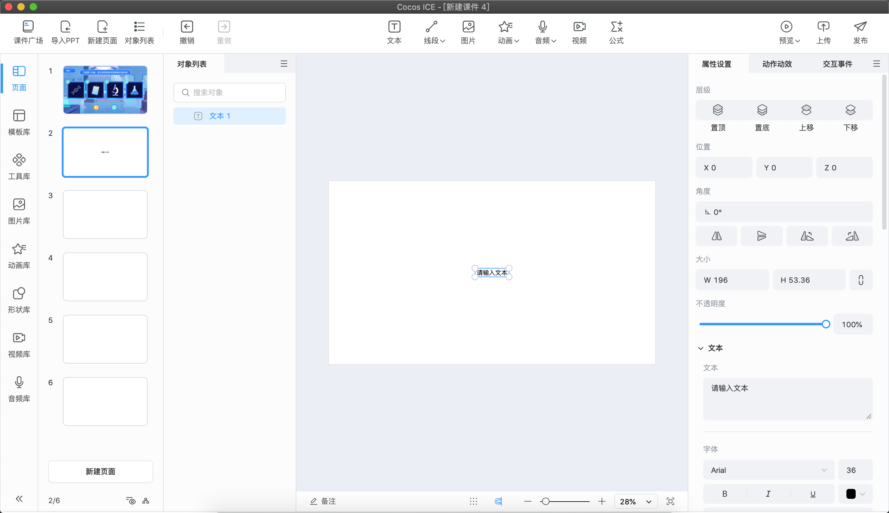

# 文字

选中文字对象，可以在右侧属性面板编辑 **文字内容**、**字体**、**字号**、**行距**、**颜色**、**特殊样式**、**对齐方式**、**文本类型**、**文本框类型** 等。

## 编辑字体

为了保证企业使用字体版权的安全性，目前 ICE 仅支持研发配置好可选字体分发给老师，老师通过下拉框就可以选择使用，具体可查看研发手册的 [文字配置文档](../../../developer/configure/object/word/index.md)。

## 编辑文本框类型

ICE 支持用户选择使用以下 4 种文本框类型：

- **不自动调整**：无论用户输入的文字量多少，文本框的大小不变，默认为该选项。

- **溢出时缩排文字**：文本框大小不变，文字字号会缩小至刚好在文本框内能显示。

- **根据文字调整文本框宽度**：文本框高度不变，宽度会根据文字长度增加。

- **不自动调整**：文本框宽度不变，文字会自动换行，高度会根据文字长度增加。

