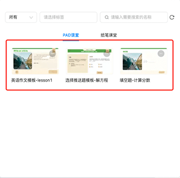
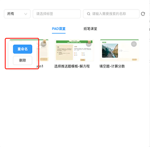

# 个人题库

用户通过使用 **题目模板** 里的模板进行编辑后，编辑后的模板可以存放在 **个人题库** 里。

- **类别**：个人题库分为三个类别，分别为 **PAD 课堂**、**纸笔课堂** 和 **答题器课堂**，用户可通过选择类别快速的找到各个类别下对应的题目。

- **学科筛选器**：筛选器默认选择全部，并支持筛选数学和英语学科的模板。

    - **全部**：基于所有模板添加的个人题目。

    - **数学**：基于推送题模板和通用题模板添加的个人题目。

    - **英语**：基于英语题模板和通用题模板添加的个人题目。

- **关键词筛选**：支持通过输入关键词，实现对个人题库的筛选。

- **标签筛选**：支持通过标签实现对个人题库的筛选。

## 编辑个人题库

点击个人题库里模板的  按钮，可以对选择的模板进行编辑，编辑操作包括 **重命名** 和 **删除**。

- **重命名**：可以对选择的个人题库下模板的名称进行修改。

- **删除**：可以对选择的个人题库下的模板进行删除。
